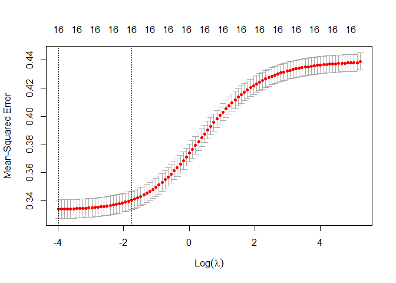

# 1. Predicting wages in USA


```r
# install (if missing) packages
list_packages <- c("dplyr", "formatR", "ggplot2", "glmnet", "hdm", "Hmisc")
new_packages <- list_packages[!(list_packages %in% installed.packages()[,"Package"])]
if(length(new_packages)) install.packages(new_packages)

# Load packages
sapply(list_packages, require, character.only = TRUE)
```

## (a) Load, prepare and summarize the data


```r
## Load prepare and summarize the data

# Load Census data from the US for the year 2012
data("cps2012")

# Check data and summarize
str(cps2012)
summary(cps2012) #no missing obs.
head(cps2012)
describe(cps2012)
```

## (b) Apply Ridge-Regression with cross-validation (CV)

The ridge regression coefficient estimates $\hat{\beta}_R$ are the values that minimize $$\sum_{i=1}^{n}\left(y_i-\beta_0-\sum_{j=1}^{p}\beta_j x_{ij}\right)^2+\lambda\sum_{j=1}^{p}\beta_j^2$$

Where $\lambda\geq 0$ is a tuning parameter that shrinks the estimates of $\beta_j$ towards zero as $\lambda\to\infty$ (with the extreme case were all coefficient estimates are zero and the model contains no predictors). When $\lambda=0$ the ridge coefficient estimates are the same as least squares (OLS) estimates.

Implementing ridge regression requires a method for selecting a value for $\lambda$. This selection can be done using cross-validation (CV). A grid of values for $\lambda$ is chosen and the cross-validation error for each value is computed. The optimal value of $\lambda$ is that for which the cross-validation error is smallest. 

It's important to note that by default, the `glmnet()` function standardizes the variables so that they are on the same scale. This is done because ridge regression coefficients are depending on the scaling of the predictors. 

### (i) Apply ridge regression to the previous dataset for the the default grid of values of lambda. Plot the 10-fold CV MSE as a function of lambda.


```r
# Define dependent variable y: lnw
y <- cps2012$lnw

# Define matrix of predictors
x <- cps2012 %>% select(female, widowed, divorced, separated, nevermarried, hsd08, 
    hsd911, hsg, cg, ad, mw, so, we, exp1, exp2, exp3) %>% data.matrix()

## Apply ridge regression using glmnet

# Estimate ridge model using train data and 10-fold CV (we need to set alpha = 0
# to get ridge coefficients)
cv_ridge <- cv.glmnet(x, y, alpha = 0)
summary(cv_ridge)
```

```
##            Length Class  Mode     
## lambda     100    -none- numeric  
## cvm        100    -none- numeric  
## cvsd       100    -none- numeric  
## cvup       100    -none- numeric  
## cvlo       100    -none- numeric  
## nzero      100    -none- numeric  
## call         4    -none- call     
## name         1    -none- character
## glmnet.fit  12    elnet  list     
## lambda.min   1    -none- numeric  
## lambda.1se   1    -none- numeric
```

```r
# Draw plot of training MSE as a function of lambda
plot(cv_ridge)
```

<div class="figure" style="text-align: center">

<p class="caption">MSE for the ridge regression predictions, as a function of $\lambda$.</p>
</div>
### Select the optimal lambda ($\lambda$) by cross-validation. How many variables are used in the
Ridge fit?


```r
# Optimal value of lambda
opt_lamb <- cv_ridge$lambda.min
opt_lamb
```

```
## [1] 0.01845918
```

```r
# Model estimation using optimal value of lambda
ridge_reg <- glmnet(x, y, alpha = 0, lambda = opt_lamb)
```

The optimal lambda is $\lambda^*=$ 0.0184592    

